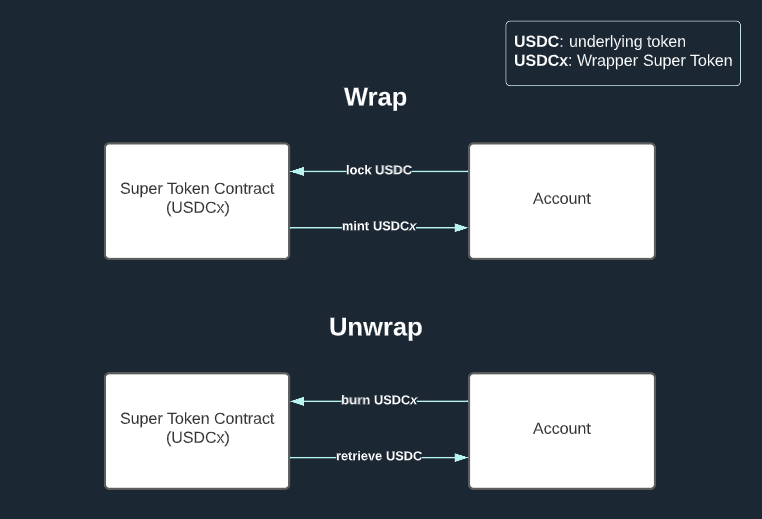
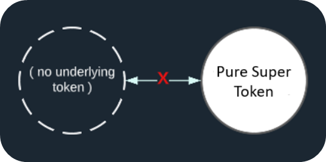

import Tabs from '@theme/Tabs';
import TabItem from '@theme/TabItem';

# Super Tokens

Super Tokens extend the ERC20 token standard with additional functionalities like [Money Streaming](./money-streaming.mdx) or [Distributions](./distributions.mdx), known as Super Agreements. There are two types of Super Tokens: wrapper and custom.

:::info
Super Tokens can perform all the functions of a traditional ERC20 token, plus additional value transfer methods enabled by Superfluid, such as money streaming.
:::

## Real-Time Balance

Super Tokens track an account's balance dynamically, factoring in both regular transfers and impacts from Super Agreements.

- **Static Balance**: The standard ERC20 balance affected by lump-sum transfers.
- **Real-Time Balances**: The ongoing impact of each Super Agreement on an account's balance, which can be positive or negative.

The actual current balance is a sum of these components.

> **Current Balance Formula**: Current Balance = Real-Time Balances + Static Balance

### Example Calculation

- Account A's Static Balance: 1,000 USDCx
- Account A's CFA Stream Out: -100 USDCx
- Account A's IDA Receipts: +200 USDCx

> **Current Balance**: 1000 - 100 + 200 = **1100 USDCx**

A Super Token's `balanceOf()` function reflects this dynamic balance, unlike a regular ERC20's static approach.

## Types of Super Tokens

<Tabs>
  <TabItem value="wrapper" label="Wrapper">
    Wrapper Super Tokens are existing tokens wrapped to gain Superfluid functionalities. Wrapping converts the underlying token into its Super Token version, while unwrapping reverses the process.

    

    **Example**: Converting a standard token to a Super Token and vice versa.
  </TabItem>
  <TabItem value="pure" label="Pure">
    Pure Super Tokens are natively Superfluid-enabled without an underlying token. They offer inherent ERC20 functionalities plus Superfluid's Super Agreement capabilities.

    

    **Example**: $RIC by Ricochet DAO, a governance token deployed as a pure Super Token for extensive use of Super Agreements.
  </TabItem>
</Tabs>
